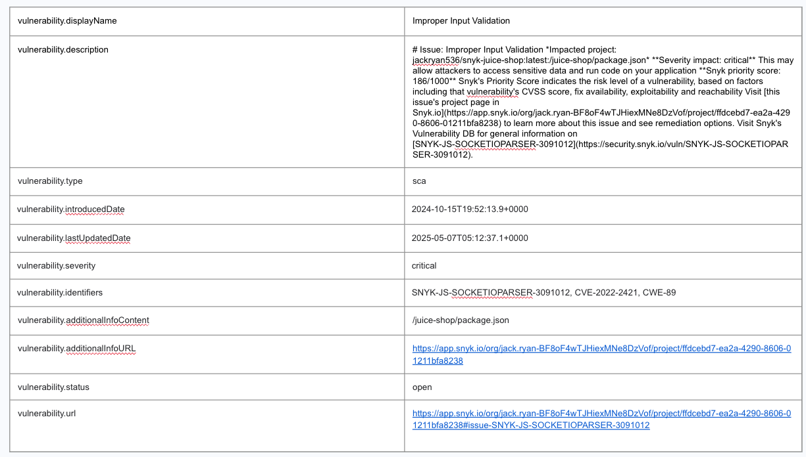
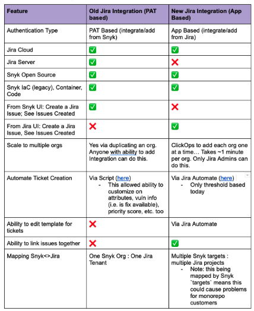

# jira-sample-automations
This repo contains sample automation to be used in conjunction with the [Snyk Security in Jira Cloud Integration](https://docs.snyk.io/integrate-with-snyk/jira-and-slack-integrations/snyk-security-in-jira-cloud-integration)

[Jira Automation Info](https://www.atlassian.com/software/jira/features/automation)

[Jira Smart Values Security](https://support.atlassian.com/cloud-automation/docs/jira-smart-values-security/)

[Jira Smart Values Text Fields](https://support.atlassian.com/cloud-automation/docs/jira-smart-values-text-fields/)

[Snyk REST APIs](https://apidocs.snyk.io/?version=2024-10-15)

### Jira Automation example - SCA. This is the information developers get in Jira. There is more information via /issues endpoint

### Comparison of the 2 Jira Integrations

### Issues
* [Smart value for webResponse is not parsing correctly JSON when vnd.api+json response headers is received](https://jira.atlassian.com/browse/AUTO-1293)
