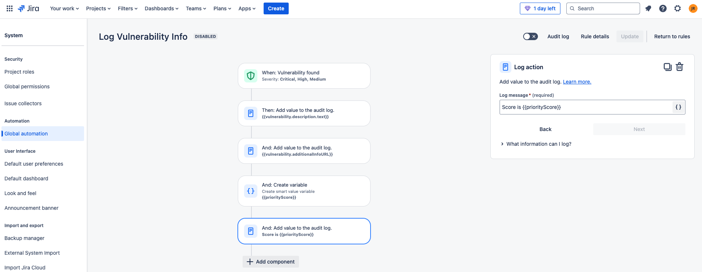

# Add vulnerability information to the Jira audit log

## Steps
1. WHEN a Vulnerability is found, check that the severity matches one of your filters (Critical, High, Medium, Low)
2. THEN Add the vulnerability.description.text to the audit log
3. AND Add the vulnerability.additionalInfoURL to the audit log
4. AND create a variable named priorityScore. The value of this variable is vulnerability.description.text.match("Snyk priority score: \*(\d+)/")
5. AND Add priorityScore to the audit log

