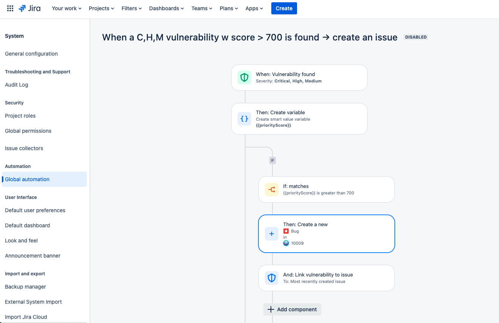

1. WHEN Vulnerability is found (Critical, High, Medium, Low)
2. THEN Create a variable priorityScore with value vulnerability.description.text.match("Snyk priority score: \*(\d+)/")
3. IF priorityScore greater than 700
4. THEN Create a new bug in Jira Project
5. AND link vulnerability to issue

)