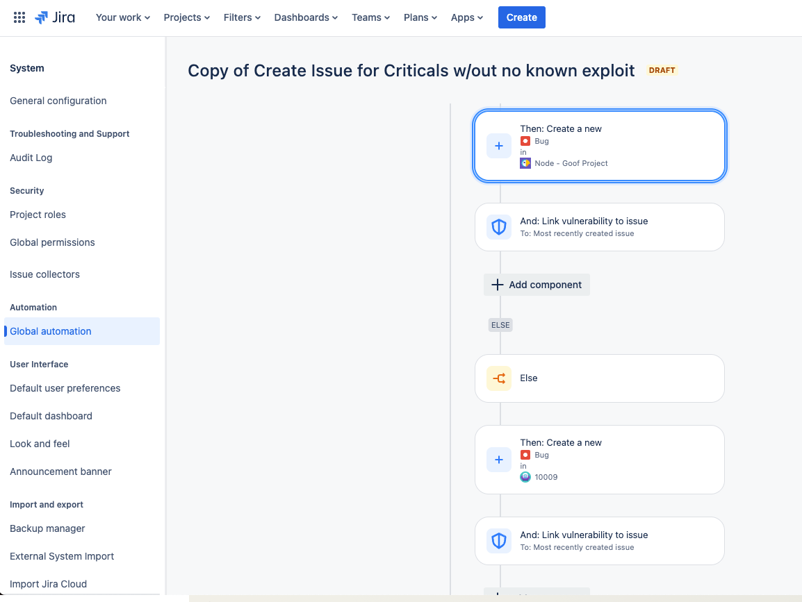

# Steps
1. WHEN Vulnerability is found (Critical, High, Medium, Low)
2. THEN Create variable for orgSlug with value vulnerability.url.match("\/org\/([^\s\/]+)")
3. AND log vulnerability.status
4. AND send web request
- GET https://api.snyk.io/rest/orgs?version=2024-01-23&slug={{orgSlug}}
- Body: None
5. AND Create variable orgID with value webResponse.body.match("\"id\":\"([a-f0-9-]+)\"")
6. AND create variable issueID with value vulnerability.url.match("#issue-([^\\s]+)")
7. AND log vulnerability.type
8. AND log issueID
9. AND send web request
- POST https://snyk.io/api/v1/reporting/issues/?from=2017-01-01&to=2024-12-31
- {
   "filters":{
      "orgs":[
         "{{orgID}}"
      ],
      "issues":[
          "{{issueID}}"
      ]
   }
}
10. IF vulnerability.type equals sca
11. THEN create variable exploitMaturity with value webResponse.body.results.issue.exploitMaturity
12. IF exploitMaturity does not equal no-known-exploit
13. THEN create a new bug issue in Jira
14. Link Vulnerability to issue
15. ELSE
16. THEN create a new bug
17. Link vulnerability

## Screenshots

